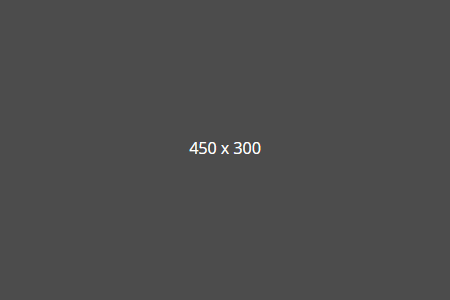

# Image Placeholder Generator

> Generate custom placeholder images on the fly.

---

## How to use this generator

Just embed the url _https://image-placeholder.now.sh/_ in an img tag and you will get a placeholder image. By default, the returned image has the following settings, which you can change with queries (examples in parentheses):

- width: 450px `?w=200`
- height: 300px `?h=500`
- background color: #4c4c4c `?background=yellow`
- border color: same like background color `?border=green`
- border width: 1px `?borderWidth=3`
- text color: #fff `?color=green`
- text: [width] x [height] `?text=Visit image-placeholder.now.sh`

All queries are optional. For all there are default values. Also the order of the queries is irrelevant.

  
_Image with default settings._

  
_Customized image with settings from the example._  
_URL: https://image-placeholder.now.sh/?w=300&h=300&background=yellow&border=green&borderWidth=3&color=green&text=Visit%20image-placeholder.now.sh_

---

## License

Licensed under the [MIT](https://github.com/peter-stuhlmann/ImagePlaceholder/blob/master/LICENSE) license by [Peter R. Stuhlmann](https://peter-stuhlmann-webentwicklung.de).
